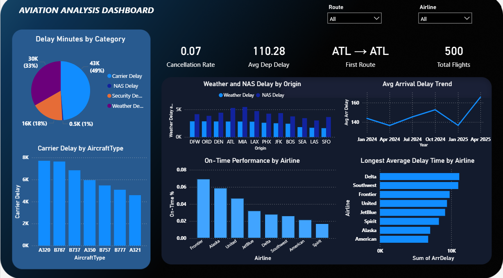

# ✈️ Aviation Analytics Dashboard – Power BI

## 📌 Project Overview
This project focuses on analyzing airline performance using Power BI. The dashboard provides insights into flight delays, cancellations, on-time performance, and delay reasons across airlines and routes.

## 🎯 Objective
- Identify major delay categories and their impact
- Analyze airline-wise and route-wise delay trends
- Track on-time performance and average delays
- Support data-driven operational improvements

## 🛠 Tools & Technologies
- Power BI
- DAX
- SQL (Data preprocessing)
- Excel / CSV Dataset

## 📊 Key Insights
- Carrier delays contribute the highest share of total delays
- Certain aircraft types experience more frequent delays
- On-time performance varies significantly across airlines
- Seasonal trends affect average arrival delays

## 📷 Dashboard Preview

## 📂 Dataset
Public aviation dataset (CSV format)

## 👩‍💻 Author
**Sophie Dorina**  
Aspiring Data Analyst
